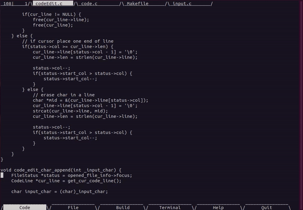
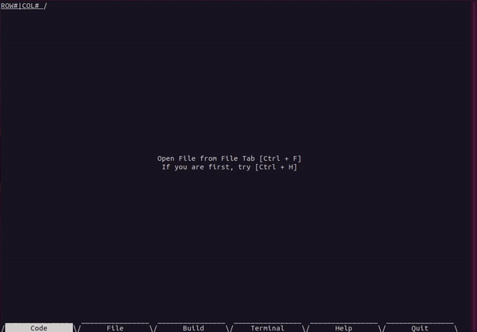
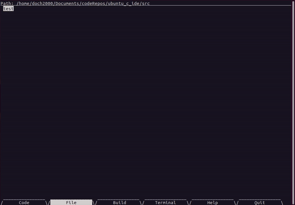

# Ubuntu_C_IDE
C Integrated Development Environment running on Ubuntu\
This program supports code edit & workspace management with easy build solution


## how to run?
from /src directory, call make (first execution only) & execute main.out
```bash
$ make
$ ./main.out
```
* Notice : you need curses library to be installed on your system
* if you want to change execution file name, try to change makefile
## features
* if you are first, try manual! learn about various key support & manipulation



* you can search dir & set workspace where you code & manage files



* if you set workspace, program will offer makefile & easy build function

